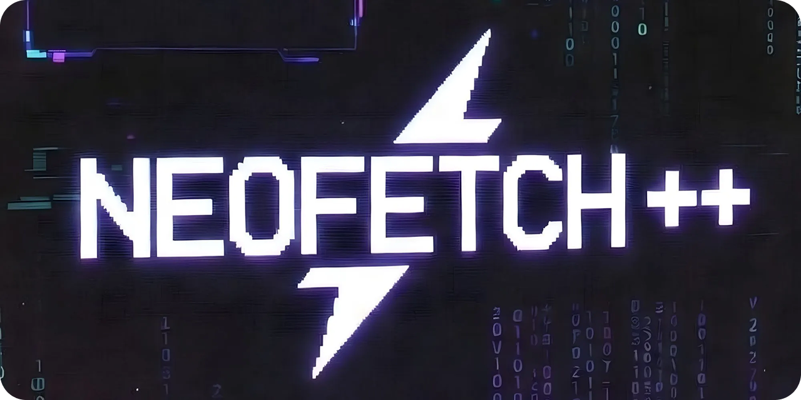

<div align="center">



# 🚀 LLM-Neofetch++ 


**Advanced System Information Tool for Local LLM Usage**

Show detailed hardware specs optimized for running local AI models

</div>

---

## ✨ Features

### 🔍 **Comprehensive Hardware Detection**
- ✅ **CPU**: Model, cores, threads, frequency, temperature, usage
- ✅ **GPU**: NVIDIA (nvidia-smi), AMD (rocm-smi), Intel Arc detection
- ✅ **VRAM**: Total, used, and available video memory
- ✅ **RAM**: Physical memory and swap information
- ✅ **Storage**: Disk type (NVMe/SSD/HDD), capacity, speed benchmarks
- ✅ **Battery**: Charge level, power status, time remaining (laptops)
- ✅ **Apple Silicon**: M1/M2/M3/M4 detection with unified memory

### 🎯 **Smart AI/LLM Features**
- 🤖 **Model Recommendations**: Personalized suggestions based on your hardware
- 📊 **Quantization Guide**: GGUF formats explained (Q2_K through Q8_0)
- 🚀 **Backend Comparison**: Ollama, llama.cpp, vLLM, ExLlamaV2, LM Studio
- ⚡ **Performance Estimates**: Token/s predictions for different model sizes
- 💡 **Optimization Tips**: Specific advice for your system configuration

### 🎨 **Beautiful UI**
- 🌈 **Color-coded Output**: Easy to read with semantic colors
- 📊 **Progress Bars**: Visual representation of usage and capacity
- 🔧 **Configurable**: Customize colors, emoji, detail level
- 📱 **Responsive**: Adapts to terminal width

### 🛠️ **Developer Friendly**
- 📤 **Export Formats**: JSON, YAML, Markdown
- 🧪 **Unit Tests**: Comprehensive test coverage
- 🔌 **Modular Design**: Easy to extend and customize
- 📝 **Type Hints**: Full type annotations
- 🐛 **Verbose Mode**: Detailed logging for debugging

---

## 📦 Installation

### From Source (Recommended)

```bash
# Clone the repository
git clone https://github.com/HFerrahoglu/llm-neofetch-plus.git
cd llm-neofetch-plus

# Install dependencies
pip install -r requirements.txt

# Run directly
python llm_neofetch.py

# Or install globally
pip install -e .
llm-neofetch
```

### Using pip

```bash
pip install llm-neofetch-plus
llm-neofetch
```

---

## 🎮 Usage

### Basic Usage

```bash
# Normal output (default)
llm-neofetch

# Minimal output
llm-neofetch -d 1

# Detailed output with all features
llm-neofetch -d 3

# Interactive mode (choose detail level)
llm-neofetch -i
```

### Advanced Usage

```bash
# Run disk benchmark (takes ~10 seconds)
llm-neofetch -b

# Export to different formats
llm-neofetch --export report.json      # JSON format
llm-neofetch --export report.yaml      # YAML format
llm-neofetch --export report.md        # Markdown format

# Verbose logging for debugging
llm-neofetch -v

# Custom config file
llm-neofetch --config /path/to/config.yaml

# Combine options
llm-neofetch -d 3 -b --export full_report.json
```

---

## 📸 Screenshots

### Normal Output
```
╔══════════════════════════════════════════════════════════════════════════╗
║              ⚡ LLM • NEOFETCH ++  ⚡                                   ║
║         Advanced System Info for Local LLM Usage                         ║
║                    v1.0.0 • 2026 Edition                                 ║
╚══════════════════════════════════════════════════════════════════════════╝

────────────────────────────────────────────────────────────────────────────
💻 System Information
────────────────────────────────────────────────────────────────────────────
  OS             Linux-6.5.0-1-amd64-x86_64-with-glibc2.38
  Kernel         6.5.0 (x86_64)
  Uptime         2d 14h 32m
  Python         3.11.5

────────────────────────────────────────────────────────────────────────────
🔧 CPU
────────────────────────────────────────────────────────────────────────────
  Model          AMD Ryzen 9 7950X 16-Core Processor
  Cores          16 physical / 32 threads
  Frequency      4200 MHz
  Usage          [███████████░░░░░░░░░░░░░░░░░░░]  35.2%

────────────────────────────────────────────────────────────────────────────
🎮 GPU
────────────────────────────────────────────────────────────────────────────
    🟢 NVIDIA GeForce RTX 4090
      VRAM: 24.0 GB total
            [████████████░░░░░░░░░░░░░] 12.4/24.0 GB
      Usage          [█████░░░░░░░░░░░░░░░░░░░░] 20.0%
      Temp: 58°C

────────────────────────────────────────────────────────────────────────────
🎯 Personalized Model Recommendations
────────────────────────────────────────────────────────────────────────────

  ▸ Extra Large Models (70-72B)
    • Llama 3.1 70B
    • Qwen2.5 72B

  ▸ Large Models (30-34B)
    • Llama 3.1 33B
    • Qwen2.5 32B
```

---

## ⚙️ Configuration

LLM-Neofetch++ uses a YAML configuration file. By default, it looks for:

1. `./config/config.yaml` (in the project directory)
2. `~/.config/llm-neofetch/config.yaml`
3. `/etc/llm-neofetch/config.yaml`

### Sample Configuration

```yaml
# UI Settings
ui:
  box_width: 76
  use_emoji: true
  show_progress_bars: true
  compact_mode: false

# Color Theme
colors:
  primary: "\033[1;34m"    # Blue
  success: "\033[1;32m"    # Green
  warning: "\033[1;33m"    # Yellow
  danger: "\033[1;31m"     # Red

# Performance Thresholds
thresholds:
  vram:
    excellent: 24  # GB
    good: 12
    moderate: 8
```

---

## 🔧 Development

### Project Structure

```
llm-neofetch-plus/
├── llm_neofetch.py          # Main application
├── src/
│   ├── detectors.py         # Hardware detection modules
│   └── ui.py                # UI rendering and formatting
├── config/
│   └── config.yaml          # Configuration file
├── tests/
│   └── test_all.py          # Unit tests
├── requirements.txt         # Python dependencies
├── setup.py                 # Package setup
└── README.md               # This file
```

### Running Tests

```bash
# Run all tests
python tests/test_all.py

# Run with pytest (if installed)
pytest tests/

# Run with coverage
pytest --cov=src tests/
```

### Contributing

Contributions are welcome! Please:

1. Fork the repository
2. Create a feature branch (`git checkout -b feature/amazing-feature`)
3. Commit your changes (`git commit -m 'Add amazing feature'`)
4. Push to the branch (`git push origin feature/amazing-feature`)
5. Open a Pull Request

---

## 🎯 Use Cases

### For AI/ML Developers
- Quickly assess if your hardware can run specific models
- Get token/s estimates before downloading large models
- Understand which quantization format to use
- Optimize your LLM stack configuration

### For System Administrators
- Monitor system resources for AI workloads
- Export reports for documentation
- Benchmark storage performance for model loading
- Track GPU utilization and temperatures

### For Researchers
- Document hardware specs in papers
- Compare performance across different systems
- Generate reproducible system reports
- Share hardware configurations

---

## 🚀 Roadmap

- [ ] Docker container support
- [ ] Web dashboard (optional)
- [ ] Historical tracking and graphs
- [ ] Cloud GPU detection (AWS, GCP, Azure)
- [ ] LLM benchmarking suite
- [ ] Automatic model download suggestions
- [ ] Integration with popular LLM frameworks

---

## 🤝 Acknowledgments

- Built with [psutil](https://github.com/giampaolo/psutil) for cross-platform system info
- Inspired by [neofetch](https://github.com/dylanaraps/neofetch)
- Community feedback from r/LocalLLaMA

---

## 📄 License

MIT License - see [LICENSE](LICENSE) file for details

---

## 🌟 Star History

If you find this tool useful, please consider giving it a star ⭐

---

## 📞 Support

- **Issues**: [GitHub Issues](https://github.com/HFerrahoglu/llm-neofetch-plus/issues)
- **Discussions**: [GitHub Discussions](https://github.com/HFerrahoglu/llm-neofetch-plus/discussions)
- **Email**: fhamz4@proton.me

---

<div align="center">

Made with ❤️ for the Local LLM Community

</div>
