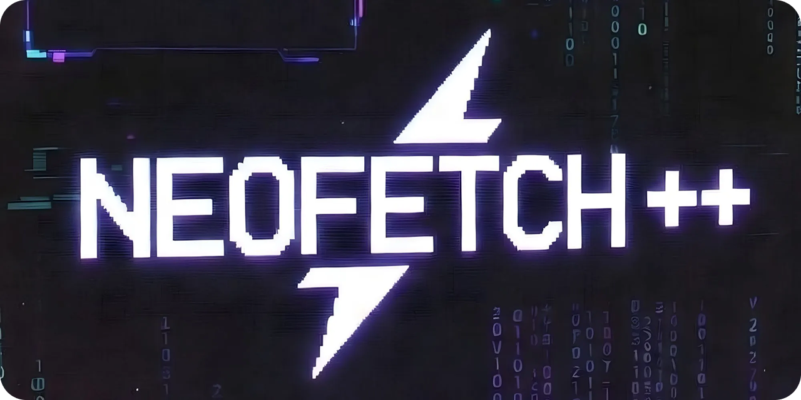

<div align="center">



# 🚀 LLM-Neofetch++ 


**Advanced System Information Tool for Local LLM Usage**

Show detailed hardware specs optimized for running local AI models

</div>

---

## ✨ Features

### 🔍 **Comprehensive Hardware Detection**
- ✅ **CPU**: Model, cores, threads, frequency, temperature, usage
- ✅ **GPU**: NVIDIA (nvidia-smi/pynvml), AMD (amd-smi/rocm-smi), Intel Arc
- ✅ **VRAM**: Total, used, and available video memory
- ✅ **NPU**: Intel AI Boost, AMD XDNA, Apple Neural Engine
- ✅ **RAM**: Capacity, module speed, and bandwidth estimate
- ✅ **Storage**: Disk type (NVMe/SSD/HDD), capacity, speed benchmarks
- ✅ **Battery**: Charge level, power status, time remaining (laptops)
- ✅ **Apple Silicon**: M1-M4 variants with GPU cores and memory bandwidth
- ✅ **AI Runtimes**: CUDA, ROCm, Vulkan, DirectML, Metal versions
- ✅ **Environment**: WSL, Docker, and cloud VM (AWS/GCP/Azure) detection

### 🎯 **Smart AI/LLM Features**
- 🤖 **Context-Aware Recommendations**: max context length and token/s
  estimates per model tier, computed from weights + KV cache on your hardware
- ✅ **`can-run` Check**: "will llama3.1:70b fit?" — per-quant verdicts with
  memory needs, speed estimates, and max context
- 🔌 **Backend Detection**: finds installed Ollama / LM Studio / llama.cpp /
  vLLM with version and running state
- 📦 **Installed Model Scan**: lists your downloaded models with a
  fits-on-GPU/CPU verdict for each
- ⚡ **Real Benchmarks**: actual tokens/s via Ollama (`--bench-llm`), memory
  bandwidth (`--bench-mem`), disk speed (`-b`)
- 📊 **Quantization Guide**: GGUF formats explained (Q2_K through Q8_0)
- 🎓 **Fine-Tuning Guide**: QLoRA/LoRA VRAM requirements with fit verdicts
- 💡 **Optimization Tips**: Specific advice for your system configuration

### 🎨 **Beautiful UI**
- 🌈 **Color-coded Output**: Easy to read with semantic colors
- 📊 **Progress Bars**: Visual representation of usage and capacity
- 🔧 **Configurable**: Customize colors, emoji, detail level
- 📱 **Responsive**: Adapts to terminal width

### 🛠️ **Developer Friendly**
- 📤 **Export Formats**: JSON, YAML, Markdown
- 🧪 **Unit Tests**: Comprehensive test coverage
- 🔌 **Modular Design**: Easy to extend and customize
- 📝 **Type Hints**: Full type annotations
- 🐛 **Verbose Mode**: Detailed logging for debugging

---

## 📦 Installation

### From Source (Recommended)

```bash
# Clone the repository
git clone https://github.com/HFerrahoglu/llm-neofetch-plus.git
cd llm-neofetch-plus

# Install dependencies
pip install -r requirements.txt

# Run directly
python -m llm_neofetch

# Or install globally
pip install -e .
llm-neofetch
```

### Using pip

```bash
pip install llm-neofetch-plus
llm-neofetch
```

---

## 🎮 Usage

### Basic Usage

```bash
# Normal output (default)
llm-neofetch

# Minimal output
llm-neofetch -d 1

# Detailed output with all features
llm-neofetch -d 3

# Interactive mode (choose detail level)
llm-neofetch -i
```

### Will it run?

```bash
# Check whether a model fits (per-quant verdicts, speed, max context)
llm-neofetch can-run llama3.1:70b
llm-neofetch can-run qwen2.5:32b --quant Q4_K_M --context 16384
# Two verdicts per quant: "Capacity" (hardware totals) and
# "Right now" (memory actually free at this moment)
# Exit code: 0 = fits, 2 = does not fit (script-friendly)
```

### Benchmarks

```bash
llm-neofetch -b                        # Disk read/write speed
llm-neofetch --bench-mem               # Memory copy bandwidth
llm-neofetch --bench-llm               # Real tokens/s via Ollama
llm-neofetch --bench-llm llama3.2:1b   # ...with a specific model
```

### Monitoring & machine output

```bash
llm-neofetch --watch                   # Live CPU/RAM/GPU/LLM-process monitor
llm-neofetch --watch --interval 5      # Slower refresh
llm-neofetch --json                    # Machine-readable JSON to stdout
llm-neofetch diff desktop.json laptop.json   # Compare two systems
```

### Appearance & export

```bash
llm-neofetch --theme dracula           # Themes: dracula, nord, solarized, mono
llm-neofetch --compact                 # Less whitespace
llm-neofetch --no-emoji                # Plain icons
llm-neofetch --export report.html      # Full-color HTML report
llm-neofetch --export report.json      # JSON / .yaml / .md also supported
```

### Advanced Usage

```bash
# Verbose logging for debugging
llm-neofetch -v

# Custom config file
llm-neofetch --config /path/to/config.yaml

# Combine options
llm-neofetch -d 3 -b --bench-mem --export full_report.html
```

---

## 📸 Screenshots

### Normal Output
```
┌─ ⚡ LLM-Neofetch++ v1.1.0 ───────────────────────────────────────────────┐
│  Advanced system info for local LLM usage                                │
└──────────────────────────────────────────────────────────────────────────┘

── 💻 System Information ───────────────────────────────────────────────────
  OS             Linux-6.5.0-1-amd64-x86_64-with-glibc2.38
  Kernel         6.5.0 (x86_64)
  Uptime         2d 14h 32m
  Python         3.11.5

── 🔧 CPU ──────────────────────────────────────────────────────────────────
  Model          AMD Ryzen 9 7950X 16-Core Processor
  Cores          16 physical / 32 threads
  Frequency      4200 MHz (max 5700 MHz)
  Usage          ███████████░░░░░░░░░░░░░░░░░░░  35.2%

── 🎮 GPU ──────────────────────────────────────────────────────────────────
  🟢 NVIDIA GeForce RTX 4090
     VRAM    ████████████░░░░░░░░░░░░░ 12.4/24.0 GB
     Usage   █████░░░░░░░░░░░░░░░░░░░░  20.0%
     Temp    58°C

── 🎯 Model Recommendations ────────────────────────────────────────────────
  Model Tier            Examples
  Extra Large (70-72B)  Llama 3.1 70B, Qwen2.5 72B
  Large (30-34B)        Llama 3.1 33B, Qwen2.5 32B, Yi 34B
  Medium (13-14B)       Llama 2 13B, Qwen2.5 14B, Mistral Medium

── 💡 Optimization Tips ────────────────────────────────────────────────────
  ✓  Excellent VRAM - Can run 70B models with Q4 quantization
  ✓  Fast storage - Quick model loading and context management
```

---

## ⚙️ Configuration

LLM-Neofetch++ uses a YAML configuration file. By default, it looks for
(first match wins, merged over built-in defaults):

1. `~/.config/llm-neofetch/config.yaml`
2. `/etc/llm-neofetch/config.yaml`
3. The bundled package config (`llm_neofetch/config/config.yaml`)

### Sample Configuration

```yaml
# UI Settings
ui:
  box_width: 76
  use_emoji: true
  show_progress_bars: true
  compact_mode: false

# Color Theme — Rich style strings (names, hex codes, or "bold cyan" combos)
colors:
  primary: "blue"
  success: "green"
  warning: "yellow"
  danger: "red"

# Performance Thresholds
thresholds:
  vram:
    excellent: 24  # GB
    good: 12
    moderate: 8
```

---

## 🔧 Development

### Project Structure

```
llm-neofetch-plus/
├── llm_neofetch/
│   ├── __init__.py          # Package exports
│   ├── __main__.py          # `python -m llm_neofetch` entry point
│   ├── app.py               # Main application and CLI
│   ├── detectors.py         # Hardware detection modules
│   ├── environment.py       # Backend/runtime/process/cloud detection
│   ├── llm_math.py          # VRAM, KV cache, and speed estimation
│   ├── ui.py                # UI rendering and formatting
│   ├── defaults.py          # Built-in default configuration
│   └── config/
│       └── config.yaml      # Bundled configuration file
├── tests/
│   └── test_all.py          # Unit tests
├── requirements.txt         # Python dependencies
├── pyproject.toml           # Package setup
└── README.md                # This file
```

### Running Tests

```bash
# Run all tests
python tests/test_all.py

# Run with pytest (if installed)
pytest tests/

# Run with coverage
pytest --cov=src tests/
```

### Contributing

Contributions are welcome! Please:

1. Fork the repository
2. Create a feature branch (`git checkout -b feature/amazing-feature`)
3. Commit your changes (`git commit -m 'Add amazing feature'`)
4. Push to the branch (`git push origin feature/amazing-feature`)
5. Open a Pull Request

---

## 🎯 Use Cases

### For AI/ML Developers
- Quickly assess if your hardware can run specific models
- Get token/s estimates before downloading large models
- Understand which quantization format to use
- Optimize your LLM stack configuration

### For System Administrators
- Monitor system resources for AI workloads
- Export reports for documentation
- Benchmark storage performance for model loading
- Track GPU utilization and temperatures

### For Researchers
- Document hardware specs in papers
- Compare performance across different systems
- Generate reproducible system reports
- Share hardware configurations

---

## 🚀 Roadmap

- [x] Cloud/VM environment detection (AWS, GCP, Azure, WSL, Docker)
- [x] LLM benchmarking (real tokens/s via Ollama, memory bandwidth)
- [x] Backend integration (Ollama, LM Studio, llama.cpp, vLLM detection)
- [x] Context-aware model recommendations (KV cache math)
- [ ] Docker container support (distribution)
- [ ] Web dashboard (optional)
- [ ] Historical tracking and graphs
- [ ] Automatic model download suggestions

---

## 🤝 Acknowledgments

- Built with [psutil](https://github.com/giampaolo/psutil) for cross-platform system info
- Inspired by [neofetch](https://github.com/dylanaraps/neofetch)
- Community feedback from r/LocalLLaMA

---

## 📄 License

MIT License - see [LICENSE](LICENSE) file for details

---

## 🌟 Star History

If you find this tool useful, please consider giving it a star ⭐

---

## 📞 Support

- **Issues**: [GitHub Issues](https://github.com/HFerrahoglu/llm-neofetch-plus/issues)
- **Discussions**: [GitHub Discussions](https://github.com/HFerrahoglu/llm-neofetch-plus/discussions)
- **Email**: fhamz4@proton.me

---

<div align="center">

Made with ❤️ for the Local LLM Community

</div>
